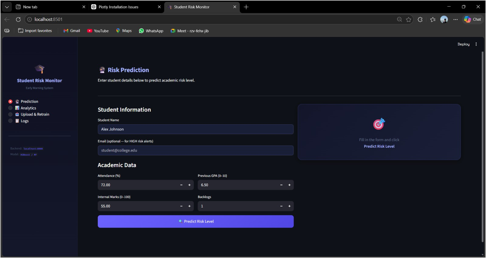
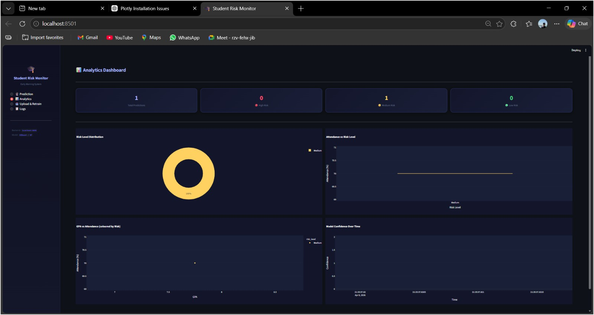
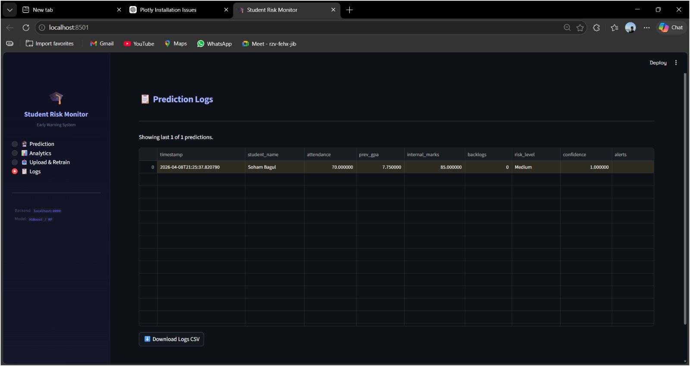

# 🎓 Student Performance Prediction & Early Warning System

🚀 A full-stack Machine Learning system that predicts student academic risk and provides early warning alerts with explainable AI.

---

## 📌 Overview

This project helps institutions identify students at **Low, Medium, or High academic risk** using ML models.
It provides **real-time predictions, alerts, analytics, and retraining capabilities**.

---

## ✨ Features

* 🎯 Risk Prediction (Low / Medium / High)
* 🚨 Smart Alert System
* 🧠 Explainable AI (Feature Importance)
* 📊 Interactive Dashboard (Streamlit)
* ⚙️ FastAPI Backend
* 📁 Dataset Upload & Retraining
* 📜 Prediction Logs & Analytics
* 📧 Email Alerts (for high-risk students)

---

## 🧠 Tech Stack

| Category         | Tools                 |
| ---------------- | --------------------- |
| Machine Learning | Scikit-learn, XGBoost |
| Backend          | FastAPI               |
| Frontend         | Streamlit             |
| Visualization    | Plotly                |
| Storage          | CSV / Pickle          |

---

## 🏗️ Project Structure

```
student_performance_system/
│
├── backend/
├── frontend/
├── model/
├── data/
├── logs/
├── requirements.txt
└── README.md
```

---

## 🚀 How to Run

### 1️⃣ Install Dependencies

```bash
pip install -r requirements.txt
```

### 2️⃣ Train Model

```bash
python model/train_model.py
```

### 3️⃣ Run Backend

```bash
cd backend
uvicorn main:app --reload
```

### 4️⃣ Run Frontend

```bash
cd frontend
streamlit run app.py
```

---

## 📊 Example Output

* Risk Level: **HIGH**
* Alerts: Low Attendance, Backlogs
* Feature Importance Graph

---

## 🧠 Model Details

* Random Forest + XGBoost
* Feature Inputs:

  * Attendance
  * GPA
  * Internal Marks
  * Backlogs

---

## 🔁 Retraining Workflow

1. Upload new dataset
2. Merge with existing data
3. Retrain model
4. Deploy updated model automatically

---

## 📈 Future Improvements

* SHAP Explainability
* Cloud Deployment
* Mobile App Integration
* Real Student Data Integration

---

## 👨‍💻 Author

**Soham Bagul**

---

⭐ If you like this project, give it a star!

## 📸 Screenshots

### 🔮 Prediction Page


### 📊 Analytics Dashboard


### 📋 Logs Page

